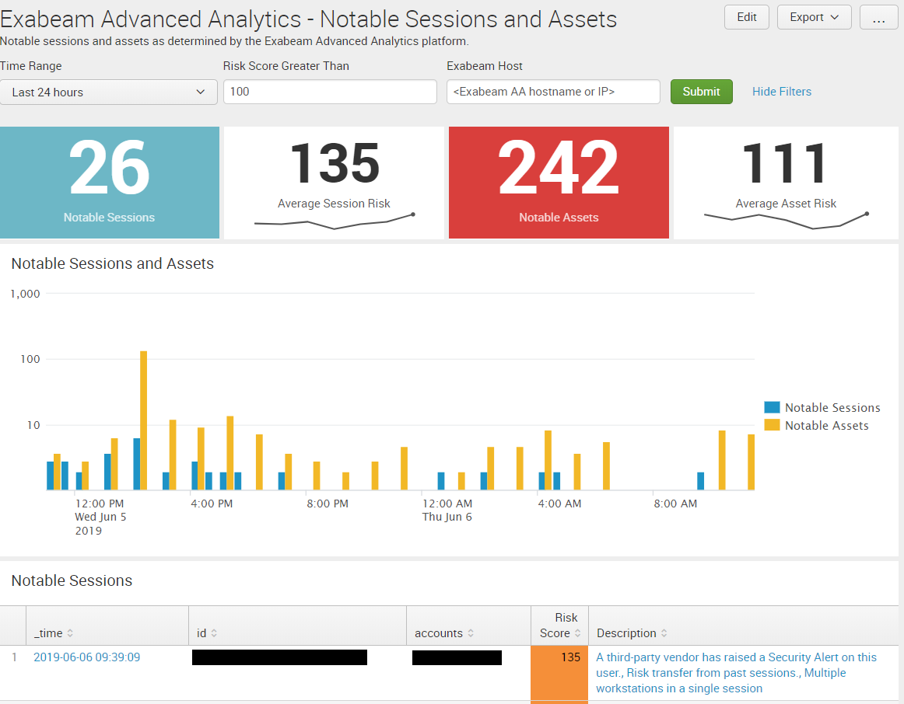
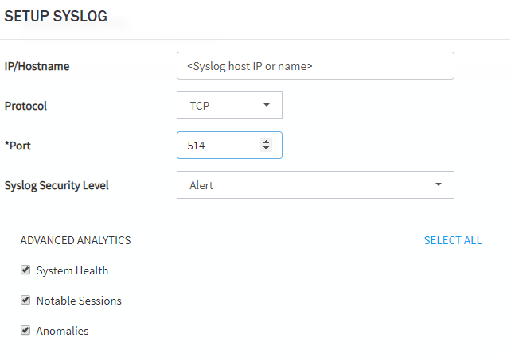

# Exabeam Advanced Analytics Dashboard for Splunk

A dashboard for getting a handle on Exabeam notable sessions and assets. Supports functionality to click through on the events table, taking you directly to the timeline on Exabeam AA.

## Requirements

You should configure Exabeam AA to send notifications for Notable Sessions, Notable Assets, System Health, and Anomalies back to an index in your Splunk search head or forwarder, and in order to be compatible with this dashboard out of the box, name it "exabeam". 

One way to accomplish this is to send the notifications to a syslog, rsyslog, or syslog-ng host, which can then pass the logs along to your heavy forwarder or universal forwarder. Something like this:

## To Do

The future roadmap for this dashboard includes indicators for System Health, statistics on Anomalies, and the ability to do long-tail analysis on rule hits.

